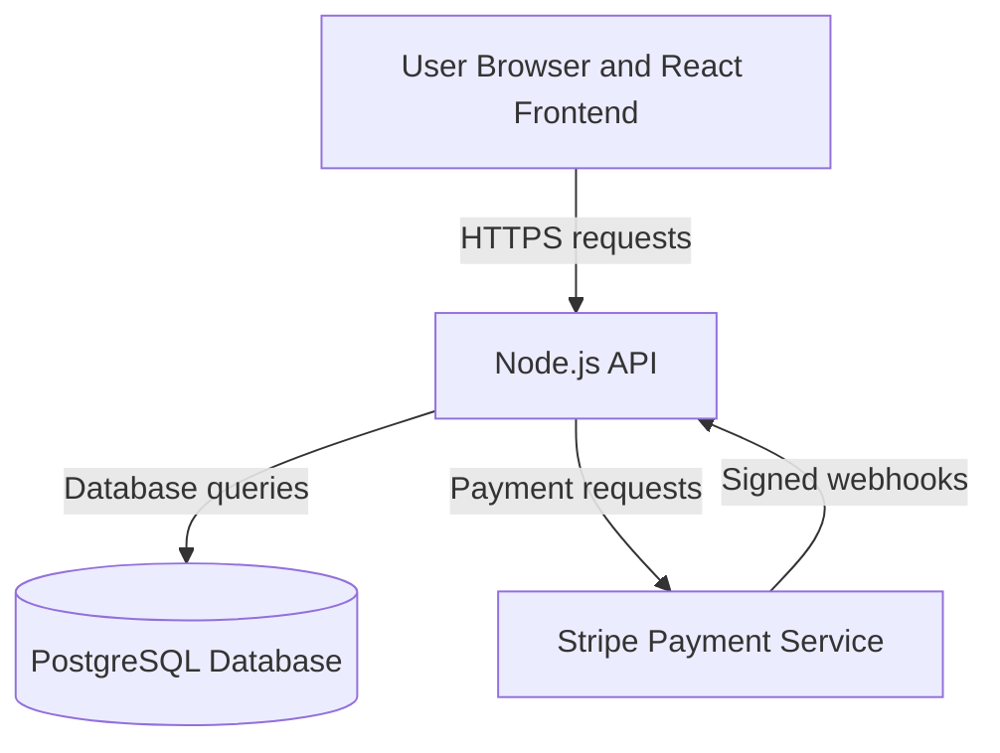

# E-commerce Platform Threat Model

## System Overview

The e-commerce platform allows users to browse products and add items to their shopping carts without authentication. Authentication is required for checkout, payment, and viewing order history.

The system consists of a React frontend, a Node.js API backend, a PostgreSQL database, and a Stripe payment integration.

## STRIDE Threat Analysis

### 1. Spoofing

**STRIDE category:** Spoofing

**Threat description:** An attacker steals a user's login credentials and impersonates them.

**Potential impact:** Unauthorized purchases, financial loss, and exposure of the user's order history and personal information.

**Suggested mitigation:** Implement multi-factor authentication (MFA), enforce strong password policies, apply login attempt rate limiting, and ensure secure session management.

### 2. Tampering

**STRIDE category:** Tampering

**Threat description:** A user modifies the price, item quantity, or product ID within the checkout request.

**Potential impact:** Purchases completed at a reduced price, incorrect order records, and financial loss to the store.

**Suggested mitigation:** Calculate and validate the final price exclusively on the backend using database records; never trust price data submitted from the frontend.

### 3. Information Disclosure

**STRIDE category:** Information Disclosure

**Threat description:** An attacker intercepts payment or personal data in transit, or accesses it through insecure logs.

**Potential impact:** Data theft, financial fraud, privacy violations, and reputational damage.

**Suggested mitigation:** Enforce HTTPS/TLS for all communications, send card data directly to Stripe without passing it through the application server, never store full card details, and remove sensitive information from application logs.

## Trust Boundaries

### Trust Boundary 1: User Browser/React Frontend to Node.js API

**Components:** Data flows between the user's browser (React frontend) and the Node.js API.

**Data crossing the boundary:** Login credentials, search queries, shopping cart contents, and checkout data are sent to the API.

**Why it is a trust boundary:** The browser and any data submitted by the user cannot be trusted. A user can tamper with a request by manipulating the price or product ID before it reaches the server. React is a client-side technology and cannot be relied upon as a security control because an attacker can bypass its JavaScript logic or frontend requests.

**Security controls:**

- Validate all incoming input.
- Enforce authentication and authorization on the backend.
- Recalculate prices server-side using PostgreSQL data.
- Protect all communications with HTTPS.
- Apply rate limiting to sensitive endpoints.
- Independently enforce all security checks on the backend.
### Trust Boundary 2: Node.js API to PostgreSQL Database

**Components:** Data flows between the Node.js API and the PostgreSQL database.

**Data crossing the boundary:** Read and write requests involving product information, user data, orders, and purchase history.

**Why it is a trust boundary:** The database is a more sensitive and trusted component than the public-facing API. If untrusted API input is concatenated directly into SQL queries, an attacker may perform SQL injection and access or modify database data.

**Security controls:**

- Use parameterized queries and prepared statements.
- Apply the principle of least privilege to the database account.
- Permit database access only from the backend.
- Encrypt sensitive data in transit and, where appropriate, at rest.
### Trust Boundary 3: Node.js API to Stripe

**Components:** Data flows between the internal Node.js API and the external Stripe payment service.

**Data crossing the boundary:** Payment amounts, payment IDs, payment status information, and tokens.

**Why it is a trust boundary:** Stripe operates outside the direct control of the store's infrastructure, making it an external trust boundary.

**Security controls:**

- Use HTTPS/TLS for all communications.
- Store and use Stripe API keys only on the backend.
- Validate Stripe webhooks using their signatures.
- Never trust payment success based solely on a frontend response.
- Never store full card details on the application server or in logs

## SQL Injection DREAD Risk Assessment

**Damage Potential: 9/10** — A successful SQL injection could allow an attacker to read the PostgreSQL database, including user credentials, personal information, and order history, or modify and delete records. This could expose customer accounts, purchase histories, and potentially payment-related metadata while damaging the integrity of business data.

**Reproducibility: 9/10** — The attack could be repeated reliably because the search feature is publicly accessible and does not require authentication. Once a working injection payload is found, it could be submitted repeatedly without special session states or timing conditions.

**Exploitability: 8/10** — Exploitation would require no special system access. An attacker could use a browser or freely available tools such as SQLMap or Burp Suite. Some trial and error might be needed to identify the injectable parameter and appropriate payload, but advanced skills or insider knowledge would not be necessary.

**Affected Users: 9/10** — A successful attack could affect every user whose information is stored in the PostgreSQL database. This could include all registered customers, their personal information, and their order histories.

**Discoverability: 7/10** — Search fields are commonly tested for SQL injection using manual techniques and automated scanners. The publicly accessible search field could be tested with common injection characters. Deliberate probing would still be required to discover the vulnerability.

### DREAD Score Calculation

The DREAD score is calculated by adding the five factor scores and dividing the total by five:

**DREAD Score = (Damage + Reproducibility + Exploitability + Affected Users + Discoverability) / 5**

**DREAD Score = (9 + 9 + 8 + 9 + 7) / 5**

**DREAD Score = 42 / 5 = 8.4/10**

**Risk level: Critical**

This score indicates that SQL injection in the product search functionality represents a critical risk. It should receive the highest remediation priority and be fixed before the system is deployed to production.

