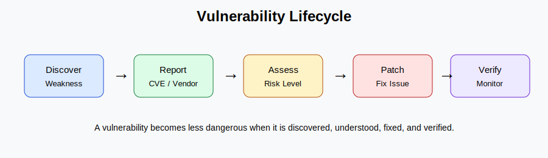

# Vulnerability in Cybersecurity: Small Weaknesses, Big Consequences

By Parshana Danesh

Imagine a company building an office with cameras, locks and security guards but leaving one small side window open. The whole building may look secure. That one weak point is enough for someone to get inside. In cybersecurity vulnerabilities work in a way. A system can have protections but one weakness in software, hardware, network configuration or human behavior can become an opportunity for attackers. I realized cybersecurity is a little like checking if the door is locked. It is boring until the day it really matters.

A cybersecurity vulnerability is a weakness or flaw that can be exploited to gain access, steal data, disrupt services or damage systems. It is not always a technical failure. Sometimes it is an outdated application, a weak password, an exposed service or a mistake in the way a system is configured. A vulnerability can exist in an application, a network, an operating system, a device or even in a company process.

## What Is a Vulnerability?

Many people think a vulnerability is a software bug but it is broader than that. For example a login form that does not check input correctly can create an injection risk. A server with open ports can expose services to attackers. A company that delays security updates may leave weaknesses available for exploitation. Even an employee clicking on a phishing email can become the starting point of a security incident. The weakness itself is not always the problem. The real danger appears when an attacker can use that weakness to cause harm.

## A Brief Historical Context

In the years of computing vulnerabilities were often treated as normal technical bugs. If a program crashed the main goal was usually to fix functionality. Security was not always the priority especially when systems were smaller and less connected. This changed when the internet became part of business. Software, servers, databases and users became connected across the world. A small flaw was no longer a local problem. It could expose customer data, interrupt services. Give attackers remote access.

## Main Types of Vulnerabilities

Vulnerabilities happen in areas.

* Software vulnerabilities are among the common. They happen in applications, operating systems, APIs or libraries.

* Network vulnerabilities appear in the way systems communicate.

* Hardware vulnerabilities exist in components such as processors, memory, firmware or embedded devices.

* Human-factor vulnerabilities are also very important. Phishing, social engineering, weak passwords and insider mistakes can all lead to compromise.

## Vulnerability, Misconfiguration, Coding Flaw and Lack of Encryption

A vulnerability is the weakness that can be exploited. However the cause of that weakness can be different.

A misconfiguration happens when a system is not set up securely.

A coding flaw is a mistake in the code.

Lack of encryption means sensitive data is not properly protected when stored or transmitted. Understanding these differences is useful because each one needs a solution.

## Impact on Technology Companies

For technology companies vulnerabilities are not technical problems. They can become business problems. A successful attack can cause data breaches, downtime, financial loss, legal issues and damage to customer trust. To reduce these risks companies use patch management, security audits, vulnerability scanning and penetration testing.

## Real-World Example: Heartbleed

Heartbleed, also known as CVE-2014-0160 is an example of how one vulnerability can create a huge problem. It affected some versions of OpenSSL a library used to protect internet communication with SSL/TLS. The vulnerability allowed attackers to read memory from systems. Fixing Heartbleed was not, about installing a patch. Organizations also had to replace certificates revoke keys, reset passwords and restore user trust.

##

A cybersecurity vulnerability may look small. Its impact can be serious. Vulnerabilities can exist in software, hardware, networks, configurations and human behavior. When attackers exploit them they can become the step of a major security breach. No organization can remove every vulnerability forever. The realistic goal is to find vulnerabilities understand their risk and fix the most important ones before attackers use them.

## References

- Digital Learning Hub: Understanding Vulnerabilities concept material

- OWASP Foundation vulnerability documentation

- NIST National Vulnerability Database

- CVE Record: CVE-2014-0160

- Heartbleed Bug official explanation
